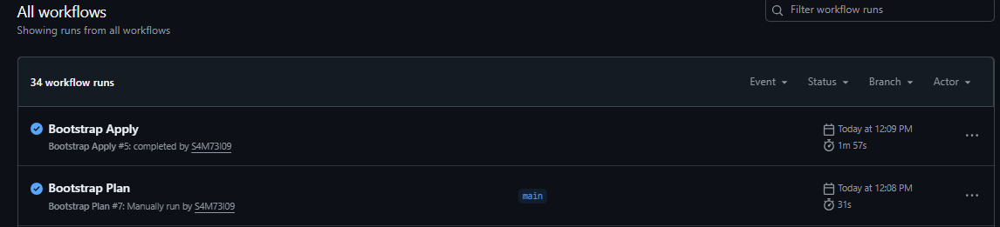
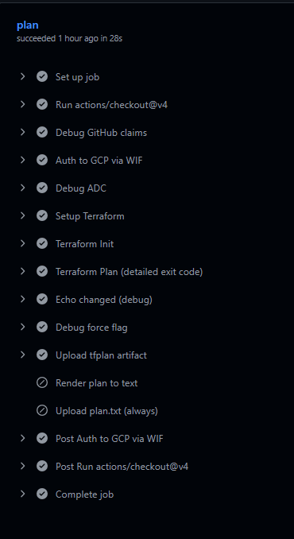

# Gcloud-Bootstrap-live EN -> [ES](README.md)

## Goal  
Separate Bootstrap (base infra and security) from Live (real infra) using Terraform + GitHub Actions + Workload Identity Federation (WIF) — no JSON keys, lock on the `main` branch and restrictions by GitHub IDs.  

### 0) High-level overview (what each piece is)

GCP Project **“Bootstrap”**  
Base infra and security: tfstate bucket, “runner” Service Account (SA), and WIF (pool + provider) for GitHub.  
➜ Changes very rarely; it’s the platform.

GCP Project **“Live”**  
“Real” infra (networks, VMs, IAM, etc.). Applied from its own repo with Terraform.  
➜ Changes often; it’s your environment.

Recommended GitHub repos:

+ ***GCS-Bootstrap---Live*** → Bootstrap only  
+ ***GCS-Live*** → Live only  

---

### 1) Bootstrap — step by step

#### 1.1 Create the project and enable APIs

* Create the **Bootstrap** project in the console or with `gcloud`.

* Enable these APIs in the Bootstrap project:
```pgsql
serviceusage, iam, iamcredentials, sts, storage, cloudresourcemanager
```

#### 1.2 GCS bucket for tfstate

* Create `gs://"bootstrap-project"-tfstate` (versioning ON; retention optional).

* Do **not** make it public; use uniform bucket-level access.

***Why:*** consistent remote state with versioning to “roll back”.

#### 1.3 “Runner” Service Account (Terraform)

* Create `terraform-bootstrap@<bootstrap-project>.iam.gserviceaccount.com`.

* Minimum permissions on the bucket (read/write for state).

  * The rest of the permissions (e.g. on the Live project) will be granted later and only where needed.

***Why:*** this SA will be the “identity in GCP” for the pipelines.

#### 1.4 Workload Identity Federation (WIF)

1) Pool (e.g. `github-pool-2`).  
2) OIDC Provider (e.g. `github-provider`) with:  
   * Issuer: `https://token.actions.githubusercontent.com/`
   * Attribute mapping:  

   ```pgsql
   google.subject      = assertion.sub
   attribute.repository= assertion.repository
   attribute.actor     = assertion.actor
   attribute.ref       = assertion.ref
   ```  

***Why:*** GitHub issues an OIDC token; GCP validates it and issues credentials without JSON keys.

#### 1.5 Fine-grained security: condition in the **provider** (not in the binding)

* Apply an `attributeCondition` in the provider (WIF) to restrict by repo ID and `main` branch:
```ini
assertion.repository_id == '<NUMERIC_REPO_ID>' &&
assertion.ref == 'refs/heads/main'
```  

(Optional, even stricter):  
```pgsql
&& assertion.repository_owner_id == '<NUMERIC_OWNER_ID>'
```  

***Why:*** avoid typosquatting (almost-identical repo names) and allow execution only on `main`.  
* You get the IDs from the GitHub API ***(`/repos/OWNER/REPO` and `/users/OWNER` → field `id`).***

#### 1.6 SA binding (without condition)

* Grant the SA ***terraform-"project-name"@...*** the role `roles/iam.workloadIdentityUser` with member:
```php-template
principalSet://iam.googleapis.com/projects/<PROJECT_NUMBER>/locations/global/workloadIdentityPools/<POOL_ID>/attribute.repository/<OWNER>/<REPO>
```  

* No condition on the binding (the restriction lives in the provider).

***Why:*** the security logic lives in the provider (where `assertion.*` exists).  

**Important:** In IAM bindings there is no `attribute.*` (hence the “undeclared reference” error).

So be careful when planning this step.

#### 1.7 GitHub Secrets (Bootstrap repo)

Create only two:

* `TF_SA_EMAIL`  
```css
terraform-bootstrap@PROJECT_ID_NAME.iam.gserviceaccount.com
```  

* `WIF_PROVIDER`  
```bash
projects/PROJECT_NUMBER/locations/global/workloadIdentityPools/github-pool-2/providers/github-provider
```  

**(Optional)** `GOOGLE_CLOUD_PROJECT=PROJECT_NAME`.

***Why:*** the action `google-github-actions/auth@v2` needs the provider path and the SA.

All these credentials can be stored in the GitHub repo secrets and referenced through variables, so no sensitive data is left in plain text.

#### 1.8 Terraform backend (Bootstrap)

`backend.tf`:
```hcl
terraform {
  backend "gcs" {
    bucket = "PROJECTNAMEtfstate"
    prefix = "global/PREFIX"
  }
}
```  

***Why:*** Terraform will store its state in the Bootstrap bucket.

#### 1.9 GitHub Actions workflow (Bootstrap)

`.github/workflows/bootstrap.yml` (Subject to change):    

**Workflow Plan**
```yaml
name: Bootstrap-Plan

on:
  push:
    branches: [ "main" ]
    paths:   [ "Bootstrap/**" ]
  pull_request:
    paths:   [ "Bootstrap/**" ]
  workflow_dispatch: {}

permissions:
  id-token: write
  contents: read

concurrency:
  group: bootstrap-plan
  cancel-in-progress: true

defaults:
  run:
    working-directory: ./Bootstrap

jobs:
  plan:
    runs-on: ubuntu-latest
    steps:
      - uses: actions/checkout@v4

      - name: Debug GitHub claims
        run: |
          echo "GITHUB_REPOSITORY     = $GITHUB_REPOSITORY"
          echo "GITHUB_REPOSITORY_ID  = $GITHUB_REPOSITORY_ID"
          echo "GITHUB_REF            = $GITHUB_REF"

      - name: Auth to GCP via WIF
        uses: google-github-actions/auth@v2
        with:
          workload_identity_provider: ${{ secrets.WIF_PROVIDER }}
          service_account:           ${{ secrets.TF_SA_EMAIL }}

      - name: Debug ADC
        run: gcloud auth application-default print-access-token >/dev/null && echo "ADC OK"

      - name: Setup Terraform
        uses: hashicorp/setup-terraform@v3
        with:
          terraform_version: 1.8.5

      - name: Terraform Init
        run: terraform init -input=false

      # 0 = no changes, 2 = changes, 1 = error
      - name: Terraform Plan (detailed exit code)
        id: plan
        shell: bash
        run: |
          set +e
          terraform plan -input=false -lock-timeout=3m -out=tfplan -detailed-exitcode
          ec=$?
          echo "exitcode=$ec" >> $GITHUB_OUTPUT
          if [ "$ec" -eq 2 ]; then
            echo "changed=true"  >> $GITHUB_OUTPUT
            exit 0
          elif [ "$ec" -eq 0 ]; then
            echo "changed=false" >> $GITHUB_OUTPUT
            exit 0
          else
            exit $ec
          fi

      - name: Upload tfplan artifact
        if: steps.plan.outputs.changed == 'true'
        uses: actions/upload-artifact@v4
        with:
          name: tfplan
          path: tfplan
          retention-days: 3
```

**Workflow Apply**
```yaml
name: Bootstrap Apply

on:
  workflow_run:
    workflows: ["Bootstrap Plan"]     # EXACT name of the plan workflow
    types: [completed]
    branches: [main]

permissions:
  id-token: write
  contents: read
  actions: read                       # needed to list/download artifacts

concurrency:
  group: bootstrap-apply
  cancel-in-progress: true

defaults:
  run:
    working-directory: ./Bootstrap

jobs:
  detect:
    if: ${{ github.event.workflow_run.conclusion == 'success' }}
    runs-on: ubuntu-latest
    outputs:
      has_tfplan:  ${{ steps.find.outputs.has_tfplan }}
      artifact_id: ${{ steps.find.outputs.artifact_id }}
      plan_run_id: ${{ github.event.workflow_run.id }}
    steps:
      - uses: actions/checkout@v4

      - name: Find tfplan artifact
        id: find
        uses: actions/github-script@v7
        with:
          script: |
            const run_id = ${{ github.event.workflow_run.id }};
            const { data } = await github.rest.actions.listWorkflowRunArtifacts({
              owner: context.repo.owner,
              repo:  context.repo.repo,
              run_id
            });
            const a = data.artifacts.find(x => x.name === 'tfplan' && !x.expired);
            core.setOutput('has_tfplan', a ? 'true' : 'false');
            core.setOutput('artifact_id', a ? String(a.id) : '');
            core.info('Artifacts found: ' + data.artifacts.map(x => `${x.name}#${x.id} expired=${x.expired}`).join(', '));

      - name: Echo has_tfplan (debug)
        run: echo "has_tfplan=${{ steps.find.outputs.has_tfplan }} artifact_id=${{ steps.find.outputs.artifact_id }} plan_run_id=${{ github.event.workflow_run.id }}"

  apply:
    needs: detect
    if: ${{ needs.detect.outputs.has_tfplan == 'true' }}
    runs-on: ubuntu-latest
    environment: bootstrap            # will require approval here
    steps:
      - uses: actions/checkout@v4

      - name: Auth to GCP via WIF
        uses: google-github-actions/auth@v2
        with:
          workload_identity_provider: ${{ secrets.WIF_PROVIDER }}
          service_account:           ${{ secrets.TF_SA_EMAIL }}

      - name: Setup Terraform
        uses: hashicorp/setup-terraform@v3
        with:
          terraform_version: 1.8.5

      - name: Terraform Init
        run: terraform init -input=false

      - name: List artifacts (debug)
        uses: actions/github-script@v7
        with:
          script: |
            const run_id = ${{ needs.detect.outputs.plan_run_id }};
            const { data } = await github.rest.actions.listWorkflowRunArtifacts({
              owner: context.repo.owner,
              repo:  context.repo.repo,
              run_id
            });
            core.info('Artifacts: ' + data.artifacts.map(a => `${a.name}#${a.id} expired=${a.expired}`).join(', '));

      - name: Download tfplan from Plan run
        id: download_tfplan
        uses: actions/download-artifact@v4
        with:
          name: tfplan
          path: Bootstrap
          repository: ${{ github.repository }}
          run-id: ${{ needs.detect.outputs.plan_run_id }}
          github-token: ${{ secrets.GITHUB_TOKEN }}

      # Fallback if standard download fails (downloads ZIP via API and unzips)
      - name: Fallback download via API
        if: failure()
        uses: actions/github-script@v7
        with:
          script: |
            const fs = require('fs');
            const idStr = '${{ needs.detect.outputs.artifact_id }}';
            if (!idStr) { core.setFailed('No artifact_id to fallback'); return; }
            const artifact_id = parseInt(idStr, 10);
            const res = await github.rest.actions.downloadArtifact({
              owner: context.repo.owner,
              repo:  context.repo.repo,
              artifact_id,
              archive_format: 'zip'
            });
            fs.mkdirSync('Bootstrap', { recursive: true });
            fs.writeFileSync('Bootstrap/tfplan.zip', Buffer.from(res.data));

      - name: Unzip tfplan (fallback)
        if: always() && steps.download_tfplan.outcome == 'failure'
        run: |
          sudo apt-get update -y && sudo apt-get install -y unzip >/dev/null
          unzip -o Bootstrap/tfplan.zip -d Bootstrap
          ls -la Bootstrap

      - name: Ensure tfplan exists
        run: |
          test -f tfplan || { echo "tfplan not found"; exit 1; }

      - name: Check for destroy actions
        run: |
          terraform show -no-color tfplan | grep -q '^- ' && {
            echo "ERROR: Plan includes destroy, refusing to auto-apply"
            exit 1
          } || echo "No destroy detected"

      - name: Terraform Apply
        run: terraform apply -input=false -lock-timeout=3m -auto-approve tfplan
```  

***Why:*** it only runs on `main`, authenticates via WIF, pins the Terraform version, avoids race conditions and only responds to the protected environment with your user.

---

### 2) Terraform backend and config (Bootstrap)

**Minimal option**: if you don’t want to manage Bootstrap with Terraform, keep only the backend for future expansion.

* ***backend.tf***
```hcl
terraform {
  backend "gcs" {
    bucket = "bootstrap-476212-tfstate"
    prefix = "bootstrap/terraform/state"
  }
}
```  

* ***versions.tf***  
```hcl
terraform {
  required_version = ">= 1.5.0, < 2.0.0"
}
```  

**Do not manage this same bucket in this state (or you’ll create a loop).**

#### 2.1) (Recommended optional) Codify Bootstrap as IaC

Place Terraform files in the [Bootstrap](/Bootstrap/) folder so Terraform manages: SA, WIF Pool/Provider, and the binding.

(Again: the backend bucket is **not** managed here.)

```css
repo/
└─ Bootstrap/
   ├─ backend.tf
   ├─ versions.tf
   ├─ providers.tf
   ├─ main.tf
   └─ terraform.tfvars
```  

***/Bootstrap/backend.tf***
```hcl
terraform {
  backend "gcs" {
    bucket = "bootstrap-476212-tfstate"
    prefix = "bootstrap/iac/state"
  }
}
```  

***/Bootstrap/versions.tf***
```hcl
terraform {
  required_version = ">= 1.5.0, < 2.0.0"
  required_providers {
    google      = { source = "hashicorp/google",      version = "~> 5.40" }
    google-beta = { source = "hashicorp/google-beta", version = "~> 5.40" }
  }
}
```  

***Bootstrap/providers.tf***  

***Bootstrap/main.tf***  

***Bootstrap/terraform.tfvars.bootstrap***  

You can see these files inside the mentioned folder.

You can also add a ***.gitignore***:
```csharp
# Terraform
.terraform/
.terraform.lock.hcl
*.tfstate
*.tfstate.*
crash.log
override.tf
override.tf.json
*.override.tf
*.override.tf.json

# Real variables
```  

#### 2.2) Import existing resources into state (only once)

```bash
cd Bootstrap
terraform init

terraform import google_service_account.runner "projects/bootstrap-476212/serviceAccounts/terraform-bootstrap@bootstrap-476212.iam.gserviceaccount.com"

terraform import google_iam_workload_identity_pool.pool "projects/bootstrap-476212/locations/global/workloadIdentityPools/github-pool-2"

terraform import google_iam_workload_identity_pool_provider.provider "projects/bootstrap-476212/locations/global/workloadIdentityPools/github-pool-2/providers/github-provider"

# Import the binding (without using member to avoid bug)
terraform import google_service_account_iam_binding.wif_binding "projects/bootstrap-476212/serviceAccounts/terraform-bootstrap@bootstrap-476212.iam.gserviceaccount.com roles/iam.workloadIdentityUser"


terraform plan
# terraform apply  (only if you want to align naming/labels details)
```  

#### 2.3) Protecting the ***tfstate*** bucket

```bash
BUCKET="bootstrap-476212-tfstate"
TF_SA="terraform-bootstrap@bootstrap-476212.iam.gserviceaccount.com"

# PAP enforced + UBLA + versioning + 30d retention
gcloud storage buckets update gs://$BUCKET --pap
gcloud storage buckets update gs://$BUCKET --uniform-bucket-level-access
gcloud storage buckets update gs://$BUCKET --versioning
gcloud storage buckets update gs://$BUCKET --retention-period 30d

# Permissions for the SA (objects)
gcloud storage buckets add-iam-policy-binding gs://$BUCKET   --member="serviceAccount:$TF_SA" --role="roles/storage.objectAdmin"

# (Optional) Restrict to a specific state prefix
PREFIX="bootstrap/iac/state/"
gcloud storage buckets add-iam-policy-binding gs://$BUCKET   --member="serviceAccount:$TF_SA" --role="roles/storage.objectAdmin"   --condition="title=tfstate-prefix,expression=resource.name.startsWith('projects/_/buckets/$BUCKET/objects/$PREFIX')"

# Verify
gcloud storage buckets describe gs://$BUCKET   --format="yaml(iamConfiguration,versioning,retentionPolicy)"
```  

#### 2.4) Useful checks

We can verify that all commands and permissions are working:

```bash
# Provider (issuer + condition + mapping)
gcloud iam workload-identity-pools providers describe github-provider   --project=bootstrap-476212 --location=global   --workload-identity-pool=github-pool-2   --format="yaml(oidc.issuerUri,attributeCondition,attributeMapping)"

# SA binding
gcloud iam service-accounts get-iam-policy   terraform-bootstrap@bootstrap-476212.iam.gserviceaccount.com   --project=bootstrap-476212 --format=yaml
```

---

## 3) Final roles required by the Bootstrap pipeline Service Account

The Service Account used by the workflow (**terraform-bootstrap@...**) must have the following IAM roles in the project:

* Service Account Token Creator  
  `<roles/iam.serviceAccountTokenCreator>`  
* Workload Identity User  
  `<roles/iam.workloadIdentityUser>`  
* Service Account Admin  
  `<roles/iam.serviceAccountAdmin>`  
* IAM Workload Identity Pool Admin (Beta)  
  `<roles/iam.workloadIdentityPoolAdmin>`  

This unlocks:

* Read/write IAM on the service account  
* Read/manage the Workload Identity Pool and Provider  
* OIDC token issuance  
* Impersonation  

### 3.1) Components you already manage via Terraform (real IaC)

Terraform is currently the owner of:

* The runner service account (or imported)  
* IAM bindings (`google_service_account_iam_member`)  
* The Workload Identity Pool and Provider (including CEL conditions with `repo_id` and branch)  
* The rest of the project infra  

This means that repeating this setup in another cloud project basically becomes:

* Create an empty project  
* Give the new SA equivalent permissions  
* Run Terraform  

This industrializes the Bootstrap.

---

## 4) Troubleshooting (ultra-condensed)

* **OIDC with GitHub Actions and Google Cloud**  

When running the Terraform workflow in GitHub Actions with OIDC auth against Google Cloud, authentication failed with:

```text
ERROR: (gcloud.auth.application-default.print-access-token) There was a problem refreshing your current auth tokens: ('Unable to acquire impersonated credentials'. 
"Permission 'iam.serviceAccounts.getAccessToken' denied on resource (or it may not exist)." 
status: "PERMISSION_DENIED"
permission: "iam.serviceAccounts.getAccessToken"
)
```  

This was a communication issue when creating the attributes needed to use the OIDC token: GitHub expected a token that never arrived because those attributes were configured to use the **repo name** instead of ID, which was the intended design.

To fix it, two attribute mapping lines were added so communication between GitHub Actions and Google used IDs instead of names.

Go to **IAM & Admin → Workload Identity Federation → [your pool] → [your OIDC provider] → Edit.**

In **Attribute mapping**, add these lines:

```text
attribute.repository_id = assertion.repository_id
attribute.actor_id      = assertion.actor_id   # optional, only if you want to bind to the user that triggers the workflow
```  

Then in **Attribute condition** add a CEL condition to restrict who can authenticate:

```cel
assertion.repository_id == '1083637831' && assertion.ref == 'refs/heads/main'
```  

This means:

+ Only the repo with the real ID can communicate  
+ And only from the `main` branch  

This way you avoid forks or random branches using your Google Cloud identity.

Finally, grant access to the Service Account from its own page.  
In Google Console or via CLI (whichever you prefer):  

+ Go to **IAM & Admin → Service Accounts**.  
+ Open the Service Account used by Terraform (e.g. `terraform-bootstrap@...`).  
+ Go to the **“Principals with access”** tab (who can use/impersonate it).  
+ Click **“➕ Grant access”**.

In the **“New principals”** field, add a principal with this format:
```text
principalSet://iam.googleapis.com/projects/PROJECT_NUMBER/locations/global/workloadIdentityPools/POOL_NAME/attribute.repository_id/1083637831
```  

Where:  
+ `PROJECT_NUMBER` = internal numeric project ID in GCP.  
+ `POOL_NAME` = your Workload Identity Pool name.  
+ `1083637831` = the real GitHub `repository_id` (obtained via `https://api.github.com/repos/OWNER/REPO`).  

Save.

Then assign **only** these two roles on the Service Account:

+ `roles/iam.workloadIdentityUser` (Workload Identity User)  
+ `roles/iam.serviceAccountTokenCreator` (Service Account Token Creator)  

Save.

After this, the OIDC step worked correctly and Terraform was able to start.

---

* **Error in `gcloud set` argument**  

Since Terraform is already authenticated, it is not necessary to keep that argument in the workflow because it fails. It’s better to let Terraform authenticate using the provided data.

---

* **IAM usage error due to missing API**  

This error is resolved by enabling the required API:

```bash
gcloud services enable iamcredentials.googleapis.com --project bootstrap-476212
```  

---

* **Add the Service Account Token Creator role for the WIF principal:**
```hcl
# Existing WIF binding (kept)
resource "google_service_account_iam_binding" "wif_binding" {
  service_account_id = google_service_account.runner.name
  role               = "roles/iam.workloadIdentityUser"
  members            = [ local.principal_member ]
}

# ➕ Permission to issue access tokens
resource "google_service_account_iam_binding" "wif_token_creator" {
  service_account_id = google_service_account.runner.name
  role               = "roles/iam.serviceAccountTokenCreator"
  members            = [ local.principal_member ]
}
```  

---

* **Import error that was failing at the end**  

“Cannot find binding ...” when importing `google_service_account_iam_member`.  
Fixed by **importing by role**, like this:

```hcl
resource "google_service_account_iam_binding" "wif_binding" { ... }
```  

```bash
terraform import google_service_account_iam_binding.wif_binding "projects/bootstrap-476212/serviceAccounts/terraform-bootstrap@bootstrap-476212.iam.gserviceaccount.com roles/iam.workloadIdentityUser"
```  

---

* **Incorrect issuer**  

It must be exactly: `https://token.actions.githubusercontent.com/`.

* **“undeclared reference to 'attribute'” in binding**  

Do not use `attribute.*` in the binding. Move the condition to the provider with `assertion.*`.  
(Alternative: in the binding use `google.subject` with `startsWith('repo:OWNER/REPO:ref:...')`.)

* **Provider not being created**  

Create at minimum `google.subject = assertion.sub` and then update the mapping; or create it via REST API.

* **403 from GitHub**  

Verify:

* Provider `attributeCondition` (correct IDs and `refs/heads/main`).  
* `WIF_PROVIDER` and `TF_SA_EMAIL` secrets.  
* Workflow runs on `main` and has `permissions: id-token: write`.

---

## 5) Screenshots and GIFs showing Bootstrap working correctly

This section stores screenshots and GIFs that show the workflows working correctly.

After exhaustive configuration in its workflow, both run without errors.  



The **Plan** workflow basically manages the resources and elements needed for Bootstrap and creates a `tfplan` showing what is being added, removed or updated. Then that `tfplan` is uploaded as an **Artifact**, which lets us download it as a `.zip` file to inspect the configuration.  



With that, the plan is uploaded and the next workflow takes care of applying it correctly. The Apply does **not** run automatically: first we must verify that it’s really us. For security reasons, the deployment is protected by an ***Environment*** and also by user. Until I approve that confirmation, nothing is applied. This is a highly recommended security method.

The **Apply** workflow first detects the `tfplan` left by the previous workflow.


And then we can apply:


This capture shows the first deployment.

Here we see that it was applied correctly:

  

### 5.1) Plan and Apply video

#### Plan  

<details>
  <summary><b>Demo: tfplan (25s)</b></summary>

  <video 
        src="https://github.com/user-attachments/assets/8a3d398d-df9d-4d93-9b2a-17baf0caa1a7"
        controls   
        muted  
        playsinline  
        preload="metadata"  
        style="max-width:100%;width:100%;height:auto;">
  </video>

</details>

<br>  

#### Apply  

<details>  
  <summary><b>Demo: tfplan Apply + Detect (19s)</b></summary>  

  <video 
        src="https://github.com/user-attachments/assets/b555dd0d-7ac2-4ab5-9d01-c2bdb76e4f1f"
        controls  
        muted
        playsinline
        preload="metadata"
        style="max-width:100%;width:100%;height:auto;">
  </video>       

</details>   

<br>

Since the `tfplan` was already created and nothing had changed, that Apply workflow was skipped.

---

## 6) Key best practices  

* No JSON keys (WIF only).  
* Two repos: Bootstrap and Live.  
* Provider with condition by ID + `main` (prevents typosquatting).  
* Condition in the provider (`assertion.*`) — not in the binding.  
* Binding without condition (less friction, logic stays in provider).  
* Minimum permissions in Live and branch protection in GitHub.  
* Keep the ***tfstate*** bucket in the Bootstrap project with PAP + UBLA + versioning.

All information is based on my own experience and learning, and cross-checked with official Google Cloud guides.

---

## 7) Official references

### Google Cloud
- Configure WIF for pipelines (GitHub Actions, etc.): https://docs.cloud.google.com/iam/docs/workload-identity-federation-with-deployment-pipelines  :contentReference[oaicite:0]{index=0}
- Workload Identity Federation (concepts): https://docs.cloud.google.com/iam/docs/workload-identity-federation  :contentReference[oaicite:1]{index=1}
- GCP Blog: “keyless” authentication from GitHub Actions: https://cloud.google.com/blog/products/identity-security/enabling-keyless-authentication-from-github-actions  :contentReference[oaicite:2]{index=2}

### GitHub (OIDC + Actions)
- OpenID Connect in GitHub Actions (overview): https://docs.github.com/en/actions/concepts/security/openid-connect  :contentReference[oaicite:3]{index=3}
- OpenID Connect reference (claims like `sub`, `repository_id`, `ref`, etc.): https://docs.github.com/actions/reference/openid-connect-reference  :contentReference[oaicite:4]{index=4}
- Configure OIDC specifically with Google Cloud (guide + workflow): https://docs.github.com/actions/deployment/security-hardening-your-deployments/configuring-openid-connect-in-google-cloud-platform  :contentReference[oaicite:5]{index=5}
- Configure OIDC in cloud providers (overview): https://docs.github.com/actions/deployment/security-hardening-your-deployments/configuring-openid-connect-in-cloud-providers  :contentReference[oaicite:6]{index=6}
- Official action to authenticate to Google Cloud (`google-github-actions/auth`): https://github.com/google-github-actions/auth  :contentReference[oaicite:7]{index=7}
- `auth` action on Marketplace: https://github.com/marketplace/actions/authenticate-to-google-cloud  :contentReference[oaicite:8]{index=8}

### GitHub REST API (to obtain numeric IDs and avoid typosquatting)
- REST API docs (overview): https://docs.github.com/en/rest  :contentReference[oaicite:9]{index=9}
- Repo endpoint (for `repository_id`): https://docs.github.com/en/rest/repos/repos  :contentReference[oaicite:10]{index=10}
- Users endpoint (for `repository_owner_id` if needed): https://docs.github.com/en/rest/users/users  :contentReference[oaicite:11]{index=11}
